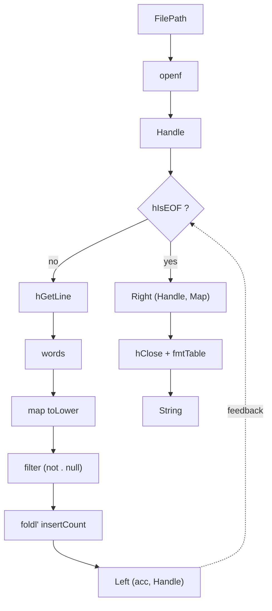

# words — a worked example

Counting word frequencies from a file, reporting the top 5. A pipeline built
from named components, composed with Trace's two constructors and `(>>>)`, metered in
one line.

The full runnable source is in
[`words/app/Main.hs`](https://github.com/tonyday567/words/blob/main/app/Main.hs).

## the circuit



The Handle is an explicit wire: produced by `openf`, threaded through the
`Either`-trace loop, and consumed by the close stage. No closures.

## components

Every function has one job. Paste any of these into the repl, feed it an
input, check the output.

```haskell
import Circuit
import Circuit.Meter (meterAction)
import Circuit.Meter.Time (Nanos, reifyC, timeM)
import Control.Arrow (Kleisli (..), runKleisli, second)
import Control.Category ((>>>))
import Data.Bool (bool)
import Data.Char (toLower)
import Data.List (sortOn)
import Data.Map.Strict (Map)
import qualified Data.Map.Strict as Map
import Data.Ord (Down (..))
import System.IO (Handle, IOMode (ReadMode), hClose, hGetLine, hIsEOF, openFile)

-- * pure stages

splitWords :: String -> [String]
splitWords = words

lowerWords :: [String] -> [String]
lowerWords = map (map toLower)

noEmpties :: [String] -> [String]
noEmpties = filter (not . null)

insertCount :: Map String Int -> String -> Map String Int
insertCount m w = Map.insertWith (+) w (1 :: Int) m

foldCounts :: [String] -> Map String Int -> Map String Int
foldCounts = flip (foldl' insertCount)

fmtTable :: Map String Int -> String
fmtTable = unlines . map fmt . take 5 . sortOn (Down . snd) . Map.toList
  where
    fmt (w, c) = w <> ": " <> show c

-- * circuit primitives — payload-neutral, no closures

openf :: Trace t (Kleisli IO) FilePath Handle
openf = Arr (Kleisli (\fp -> openFile fp ReadMode))

closef :: Trace t (Kleisli IO) Handle ()
closef = Arr (Kleisli hClose)
```

## the loop body

`Knot` wraps a Kleisli that iterates until `Right`. The Handle rides the
feedback wire alongside the accumulator.

```haskell
readAndCount :: Trace Either (Kleisli IO) Handle (Handle, Map String Int)
readAndCount = Knot (Kleisli step)
  where
    step (Left (h, acc)) =
      hIsEOF h >>= bool
        (hGetLine h >>= \line -> pure (Left (h, foldCounts (noEmpties (lowerWords (splitWords line))) acc)))
        (pure (Right (h, acc)))
    step (Right h) =
      pure (Left (h, Map.empty))
```

## the pipeline

```haskell
wordPipeline :: Trace Either (Kleisli IO) FilePath String
wordPipeline =
  openf
    >>> readAndCount
    >>> Arr (Kleisli (\(h, m) -> hClose h >> pure (fmtTable m)))
```

## running it

```haskell
wordCount :: FilePath -> IO ()
wordCount path = putStr =<< runKleisli (run wordPipeline) path
```

Expected output (run against `other/alice.md`):

```
the: 1614
and: 767
to: 706
a: 619
she: 518
```

## metering

### whole-pipeline

`meterAction timeM` brackets an arrow with clock reads. `reifyC` extracts
the Kleisli using the cartesian tensor:

```haskell
perfTest :: FilePath -> IO ()
perfTest path = do
  (t, output) <- runKleisli (reifyC (meterAction timeM (run wordPipeline))) path
  let ms = fromIntegral t / 1_000_000 :: Double
  putStrLn $ " wall: " <> show ms <> " ms"
  putStr output
```

A typical run on `other/alice.md` reports ~3–4 ms wall time.

### threading state with `second`

`Control.Arrow.second` threads a value through an arrow without the arrow
knowing about it. Here we thread a `String` tag through the entire pipeline:

```haskell
demoSecond :: FilePath -> IO ()
demoSecond path = do
  (tag, output) <- runKleisli (second (run wordPipeline)) ("tag-value", path)
  putStrLn $ "tag: " <> tag
  putStr output
```

For `(,)` tensor pipelines, `ambient (Arr k)` is exactly `Arr (second k)`.
The only work is a swap to get state into the right slot.

### instrumented run

Per-stage metering without `IORef`. Each stage is metered individually and
reported directly:

```haskell
fmtMs :: Nanos -> String
fmtMs n =
  let ms = fromIntegral n / 1_000_000 :: Double
   in if ms < 0.001 then "<0.001ms" else showFFloat (Just 3) ms "ms"

timedRun :: FilePath -> IO ()
timedRun path = do
  (tOpen, h) <- runKleisli (reifyC (meterAction timeM (run (openf :: Trace (,) (Kleisli IO) FilePath Handle)))) path

  (tRead, (h', m)) <- runKleisli (reifyC (meterAction timeM (run readAndCount))) h

  let output = fmtTable m
  (tPrint, ()) <- runKleisli (reifyC (meterAction timeM (Kleisli (\s -> hClose h' >> putStr s)))) output

  putStrLn $ "open:  " <> fmtMs tOpen
  putStrLn $ "read:  " <> fmtMs tRead
  putStrLn $ "print: " <> fmtMs tPrint
```

## references

- [circuits](../readme.md) — the library
- [circuits-meter](https://github.com/tonyday567/circuits-meter) — performance measurement
