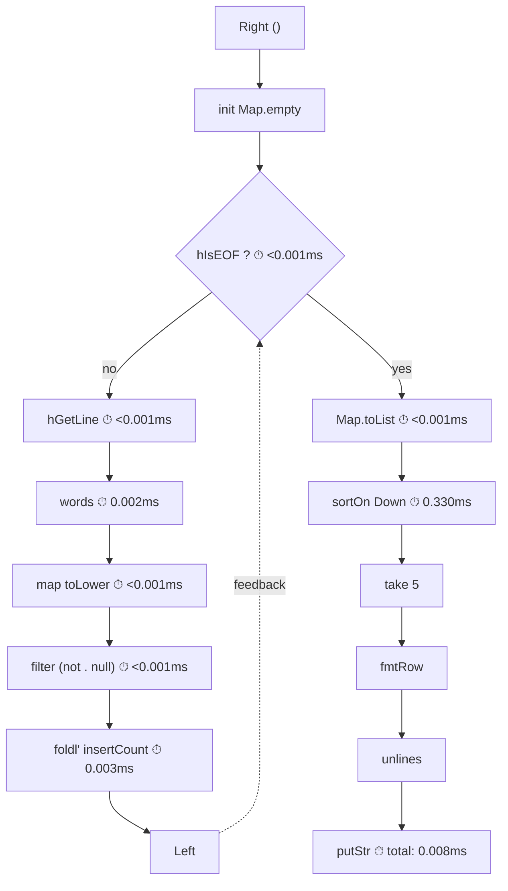

# words — a worked example

Counting word frequencies from a file, reporting the top 5. A pipeline built
from named components, composed with Circuit's three constructors, metered in
one line.

The full runnable source is in
[`words/app/Main.hs`](https://github.com/tonyday567/words/blob/main/app/Main.hs).

## the circuit



Ten named functions. Each can be tested in isolation, rearranged, or replaced.
The dashed edge is the feedback channel — the `Knot` constructor keeps it open
so stages can be inserted, metered, or inspected before the loop closes.

Timings above are averaged per-line (or total for single-shot stages) from a
run against `other/alice.md` on a warm cache.  The `timedRun` function at the
bottom of this file generates the diagram from real measurements.

## components

Every function has one job. Paste any of these into the repl, feed it an
input, check the output.

```haskell
import Circuit
import Circuit.Meter (meterA)
import Circuit.Meter.Time (meterIO, Nanos, timeM)
import Control.Arrow (Kleisli (..), runKleisli)
import Control.Category ((>>>))
import Control.DeepSeq (NFData, force)
import Control.Exception (evaluate)
import Data.Bool (bool)
import Data.Char (toLower)
import Data.IORef (modifyIORef, newIORef, readIORef)
import Data.List (sortOn)
import Data.Map.Strict (Map)
import qualified Data.Map.Strict as Map
import Data.Ord (Down (..))
import Numeric (showFFloat)
import System.IO (Handle, IOMode (ReadMode), hGetLine, hIsEOF, withFile)

-- * loop body components (runs once per line)

hGetLineIO :: Handle -> IO String
hGetLineIO = hGetLine

splitWords :: String -> [String]
splitWords = words

lowerWords :: [String] -> [String]
lowerWords = map (map toLower)

noEmpties :: [String] -> [String]
noEmpties = filter (not . null)

insertCount :: Map String Int -> String -> Map String Int
insertCount acc w = Map.insertWith (+) w (1 :: Int) acc

foldCounts :: [String] -> Map String Int -> Map String Int
foldCounts = flip (foldl' insertCount)

-- * output components

assocList :: Map String Int -> [(String, Int)]
assocList = Map.toList

sortFreq :: [(String, Int)] -> [(String, Int)]
sortFreq = sortOn (Down . snd)

topN :: Int -> [(String, Int)] -> [(String, Int)]
topN n = take n

fmtRow :: (String, Int) -> String
fmtRow (w, c) = w <> ": " <> show c

fmtTable :: [(String, Int)] -> String
fmtTable = unlines . map fmtRow
```

## the loop body

Compose the per-line components. This function is what the `Knot`
constructor wraps — it takes `Either state ()` and returns
`Either state result`, where `Left` means "more lines to read" and
`Right` means "done".

No do-notation: only `>>=`, `bool`, `either`, and point-free composition.

```haskell
loopBody
  :: Handle
  -> Kleisli IO (Either (Map String Int) ()) (Either (Map String Int) (Map String Int))
loopBody h = Kleisli (either go (const (go Map.empty)))
  where
    go acc = hIsEOF h >>= bool (step acc) (pure (Right acc))
    step acc =
      runKleisli meteredHGetLine h
        >>= pure . Left . flip foldCounts acc . noEmpties . lowerWords . splitWords . snd
```

The `Handle` is captured in the closure — it's available on every
iteration without riding the feedback channel. Only the accumulator
`Map String Int` loops back.

## the pipeline

Three constructors. `Knot` holds the loop open. `Lift` bookends it
with the format-and-print stage. `>>>` composes them.

```haskell
wordPipeline
  :: Handle
  -> Circuit (Kleisli IO) Either () ()
wordPipeline h =
  Knot (loopBody h)
    >>> Lift (Kleisli (putStr . fmtTable . topN 5 . sortFreq . assocList))
```

## running it

```haskell
wordCount :: FilePath -> IO ()
wordCount path = withFile path ReadMode $ \h -> runKleisli (reify (wordPipeline h)) ()
```

Expected output (run against `other/alice.md`):

```
the: 1614
and: 767
to: 706
a: 619
she: 518
```

`withFile` handles resource bracketing here.

## metering

### component-level

`meterIO` is now polymorphic in the tensor `t`, so the same meter can be
lifted into `Either`-based `Knot` loops as well as `(,)` pipelines.  The
type application makes this explicit:

```haskell
meteredHGetLine :: Kleisli IO Handle (Nanos, String)
meteredHGetLine = reify (meterIO hGetLineIO :: Circuit (Kleisli IO) Either Handle (Nanos, String))
```

The loop body above uses `meteredHGetLine` in place of plain `hGetLine`.

### whole-pipeline

`meterA timeM` wraps any arrow, including a `Kleisli IO` action.  Wrapping
the entire `wordCount` gives wall-clock time:

```haskell
perfTest :: FilePath -> IO ()
perfTest path = do
  (t, ()) <- runKleisli (meterA timeM (Kleisli (\_ -> wordCount path))) ()
  let ms = fromIntegral t / 1_000_000 :: Double
  putStrLn $ " wall: " <> show ms <> " ms"
```

A typical run on `other/alice.md` reports ~32–36 ms wall time.

### instrumented run

For a per-stage breakdown, `timedRun` accumulates nanoseconds into a
`TimingLog` and emits a mermaid diagram:

```haskell
data TimingLog = TimingLog
  { tIsEOF :: !Nanos,
    tHGetLine :: !Nanos,
    tWords :: !Nanos,
    tLower :: !Nanos,
    tFilter :: !Nanos,
    tFold :: !Nanos,
    tToList :: !Nanos,
    tSort :: !Nanos,
    tTake :: !Nanos,
    tFmt :: !Nanos,
    tPutStr :: !Nanos,
    nLinesRead :: !Int,
    nIterations :: !Int
  }

emptyLog :: TimingLog
emptyLog = TimingLog 0 0 0 0 0 0 0 0 0 0 0 0 0

metered :: (a -> IO b) -> Kleisli IO a (Nanos, b)
metered f = meterA timeM (Kleisli f)

meteredPure :: (a -> b) -> Kleisli IO a (Nanos, b)
meteredPure f = meterA timeM (Kleisli (evaluate . f))

meteredList :: NFData b => (a -> [b]) -> Kleisli IO a (Nanos, [b])
meteredList f = meterA timeM (Kleisli (evaluate . force . f))

fmtMs :: Nanos -> String
fmtMs n =
  let ms = fromIntegral n / 1_000_000 :: Double
   in if ms < 0.001 then "<0.001ms" else showFFloat (Just 3) ms "ms"

avgMs :: Nanos -> Int -> String
avgMs t n = fmtMs (t `div` fromIntegral (max 1 n))

mermaidDiagram :: TimingLog -> String
mermaidDiagram l =
  let n = max 1 (nLinesRead l)
   in unlines
        [ "flowchart TD",
          "    B[\"Right ()\"] --> C[\"init Map.empty\"]",
          "        C --> D{\"hIsEOF ? ⏱ " <> avgMs (tIsEOF l) (nIterations l) <> "\"}",
          "        D -->|\"no\"| E[\"hGetLine ⏱ " <> avgMs (tHGetLine l) n <> "\"]",
          "        E --> F[\"words ⏱ " <> avgMs (tWords l) n <> "\"]",
          "        F --> G[\"map toLower ⏱ " <> avgMs (tLower l) n <> "\"]",
          "        G --> H[\"filter (not . null) ⏱ " <> avgMs (tFilter l) n <> "\"]",
          "        H --> I[\"foldl' insertCount ⏱ " <> avgMs (tFold l) n <> "\"]",
          "        I --> J[\"Left\"]",
          "        J -.->|\"feedback\"| D",
          "",
          "    D -->|\"yes\"| K[\"Map.toList ⏱ " <> fmtMs (tToList l) <> "\"]",
          "    K --> L[\"sortOn Down ⏱ " <> fmtMs (tSort l) <> "\"]",
          "    L --> M[\"take 5\"]",
          "    M --> N[\"fmtRow\"]",
          "    N --> O[\"unlines\"]",
          "    O --> P[\"putStr ⏱ total: " <> fmtMs (tPutStr l) <> "\"]"
        ]

timedRun :: FilePath -> IO ()
timedRun path = withFile path ReadMode $ \h -> do
  ref <- newIORef emptyLog

  let step acc = do
        (t, eof) <- runKleisli (metered (\_ -> hIsEOF h)) ()
        modifyIORef ref $ \r -> r { tIsEOF = tIsEOF r + t, nIterations = nIterations r + 1 }
        if eof
          then pure (Right acc)
          else do
            (t, line) <- runKleisli (metered (\_ -> hGetLine h)) ()
            modifyIORef ref $ \r -> r { tHGetLine = tHGetLine r + t, nLinesRead = nLinesRead r + 1 }

            (t, ws) <- runKleisli (meteredList words) line
            modifyIORef ref $ \r -> r { tWords = tWords r + t }

            (t, wsLower) <- runKleisli (meteredList (map (map toLower))) ws
            modifyIORef ref $ \r -> r { tLower = tLower r + t }

            (t, wsFiltered) <- runKleisli (meteredList (filter (not . null))) wsLower
            modifyIORef ref $ \r -> r { tFilter = tFilter r + t }

            (t, acc') <- runKleisli (meteredPure (flip foldCounts acc)) wsFiltered
            modifyIORef ref $ \r -> r { tFold = tFold r + t }

            pure (Left acc')

      body = Kleisli $ \case
        Right () -> runKleisli body (Left Map.empty)
        Left acc -> step acc

  result <- runKleisli (trace body) ()

  (t, list) <- runKleisli (meteredPure Map.toList) result
  modifyIORef ref $ \r -> r { tToList = tToList r + t }

  (t, sorted) <- runKleisli (meteredPure (sortOn (Down . snd))) list
  modifyIORef ref $ \r -> r { tSort = tSort r + t }

  (t, top5) <- runKleisli (meteredPure (take 5)) sorted
  modifyIORef ref $ \r -> r { tTake = tTake r + t }

  (t, output) <- runKleisli (meteredPure fmtTable) top5
  modifyIORef ref $ \r -> r { tFmt = tFmt r + t }

  (t, ()) <- runKleisli (metered putStr) output
  modifyIORef ref $ \r -> r { tPutStr = tPutStr r + t }

  l <- readIORef ref
  putStrLn (mermaidDiagram l)
```

## references

- [circuits](../readme.md) — the library
- [circuits-meter](https://github.com/tonyday567/circuits-meter) — performance measurement
