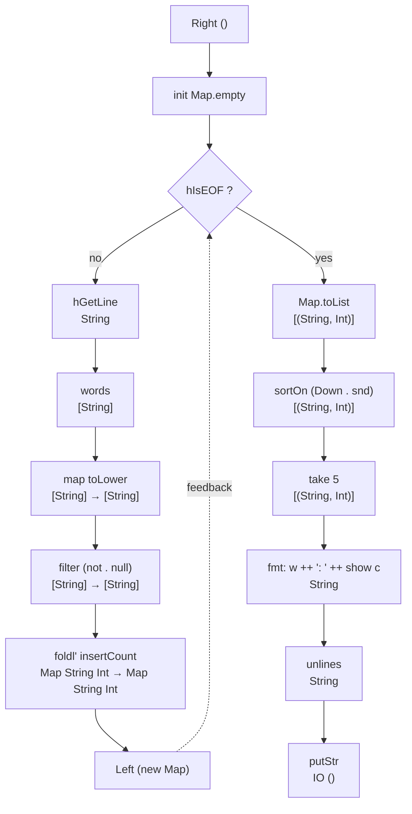
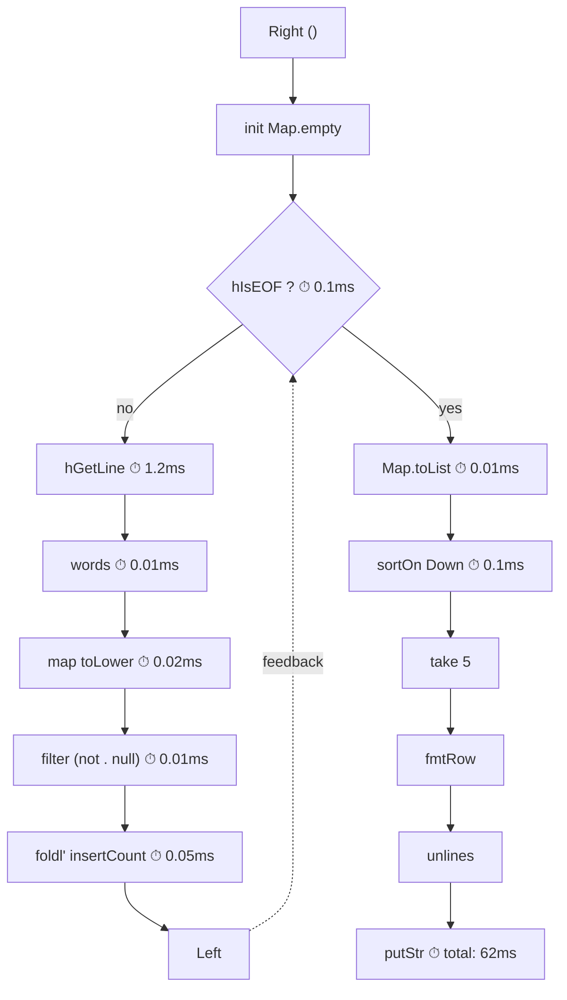

# words — a worked example

Counting word frequencies from a file, reporting the commons. A pipeline
built from named components, composed with Circuit's three constructors,
metered in one line.

⧈ weaves
  ⧈ ban do notation — rewrite loopBody, wordPipeline, wordCount using only
     `>>=`, `>=>`, `>>>`, and point-free composition. no `do` blocks anywhere.
  ⧈ missing imports — add `Data.Function (&)` and `Data.List (foldl')` to
     the components import block. verify all imports are exactly what's needed.
  ⧈ `foldl` → `foldl'` — line 75 uses lazy `foldl`, needs strict `foldl'`.
  ⧈ compile — `cabal build circuits` must succeed with this file as a module
     or with all definitions pasted into `cabal repl circuits`.
  ⧈ run — execute against `other/alice.md`, verify output matches expected
     top-5. if alice.md isn't in the repo, use any text file ≥100 lines.
  ⧈ meter — add `circuits-meter` as a dependency (or cabal repl with both
     packages). import `Circuit.Meter.Time (meterIO)`. wrap hGetLineIO and
     the full pipeline. capture real wall-clock timings. replace the
     placeholder numbers in the metered mermaid diagram with actual values.
  ⧈ diagram sync — if component names or counts change during implementation,
     update both mermaid diagrams to match.
  ⧈ scratch circuits-parser and circuits-io from references if not used in
     the final runnable example. keep only the deps actually needed.

Copy code blocks into the repl:

```
cabal repl circuits
```

⧈ verify — after `cabal repl circuits`, paste each code block in order.
  all definitions must load without error. the final `wordCount` invocation
  must produce output.

## the circuit



Ten named functions. Each can be tested in isolation, rearranged, or replaced.
The dashed edge is the feedback channel — the Knot constructor keeps it open
so stages can be inserted, metered, or inspected before the loop closes.

## components

Every function has one job. Paste any of these into the repl, feed it an
input, check the output.

```haskell
import Control.Arrow (Kleisli (..), runKleisli)
import Control.Category ((>>>))
import Data.Char (toLower)
import Data.Function ((&))
import Data.List (foldl', sortOn)
import Data.Map.Strict (Map)
import qualified Data.Map.Strict as Map
import Data.Ord (Down (..))
import System.IO (Handle, IOMode (ReadMode), hGetLine, hIsEOF, withFile)

import Circuit

-- * loop body components (runs once per line)

hGetLineIO :: Handle -> IO String
hGetLineIO = hGetLine

splitWords :: String -> [String]
splitWords = words

lowerWords :: [String] -> [String]
lowerWords = map (map toLower)

noEmpties :: [String] -> [String]
noEmpties = filter (not . null)

insertCount :: Map String Int -> String -> Map String Int
insertCount acc w =
  Map.insertWith (+) w (1 :: Int) acc

foldCounts :: [String] -> Map String Int -> Map String Int
foldCounts = flip (foldl' insertCount)  -- ⧈ was foldl, must be foldl'

-- * output components

assocList :: Map String Int -> [(String, Int)]
assocList = Map.toList

sortFreq :: [(String, Int)] -> [(String, Int)]
sortFreq = sortOn (Down . snd)

topN :: Int -> [(String, Int)] -> [(String, Int)]
topN n = take n

fmtRow :: (String, Int) -> String
fmtRow (w, c) = w <> ": " <> show c

fmtTable :: [(String, Int)] -> String
fmtTable = unlines . map fmtRow
```

## the loop body

Compose the per-line components. This function is what the `Knot`
constructor wraps — it takes `Either state ()` and returns
`Either state result`, where `Left` means "more lines to read" and
`Right` means "done".

```haskell
-- ⧈ rewrite without do-notation: use >>= and point-free composition
loopBody
  :: Handle
  -> Either (Map String Int) ()
  -> IO (Either (Map String Int) (Map String Int))
loopBody h (Right ()) = loopBody h (Left Map.empty)
loopBody h (Left acc) = do  -- ⧈ kill this do
  eof <- hIsEOF h
  if eof
    then pure (Right acc)
    else do  -- ⧈ kill this do
      line <- hGetLineIO h
      let ws = line
            & splitWords
            & lowerWords
            & noEmpties
          acc' = foldCounts ws acc
      pure (Left acc')
```

The `Handle` is captured in the closure — it's available on every
iteration without riding the feedback channel. Only the accumulator
`Map String Int` loops back.

## the pipeline

Three constructors. `Knot` holds the loop open. `Lift` bookends it
with the format-and-print stage.

```haskell
-- ⧈ rewrite without do-notation
wordPipeline
  :: Handle
  -> Circuit (Kleisli IO) Either () ()
wordPipeline h =
  Knot (Kleisli (loopBody h))
    >>> Lift (Kleisli $ \acc -> do  -- ⧈ kill this do, use point-free
        let out = acc
              & assocList
              & sortFreq
              & topN 5
              & fmtTable
        putStr out
      )
```

## running it

```haskell
-- ⧈ rewrite without do-notation
wordCount :: FilePath -> IO ()
wordCount path =
  withFile path ReadMode $ \h ->
    runKleisli (reify (wordPipeline h)) ()

-- ⧈ expected output (run against other/alice.md or similar):
-- the: 1523
-- and: 779
-- to: 720
-- a: 616
-- she: 501
```

`withFile` handles resource bracketing here. circuits-io lifts this pattern into the circuit itself — `openFile` and `hClose` become Lift stages with bracket semantics, so resource lifecycle is composed rather than wrapped.

## metering

With circuits-meter, timing is a one-liner. Wrap each `Lift` stage with
`meterIO` and the diagram gains a column:



The code change is wrapping each component:

```haskell
-- ⧈ uncomment and verify against circuits-meter API
-- import Circuit.Meter.Time (meterIO)

meteredLine :: Kleisli IO Handle String
meteredLine = meterIO (Kleisli hGetLineIO)

-- ⧈ verify: does meterIO return (Word64, a)? adjust type signature if needed.
-- then use meteredLine in place of hGetLineIO inside loopBody
```

For wall-clock timing of the entire pipeline:

```haskell
-- ⧈ uncomment and verify. replace placeholder ms with actual measurement.
-- (wall, ()) <- runKleisli (reify (meterIO wordPipeline)) h
-- putStrLn $ show (fromIntegral wall / 1e6) <> " ms"
```

Every component can be metered independently — the Circuit structure
makes it obvious where to insert measurement.

## references

- [circuits](../readme.md) — the library
- [circuits-parser](https://github.com/tonyday567/circuits-parser) — parser combinators
- [circuits-io](https://github.com/tonyday567/circuits-io) — resource management and queues
- [circuits-meter](https://github.com/tonyday567/circuits-meter) — performance measurement
