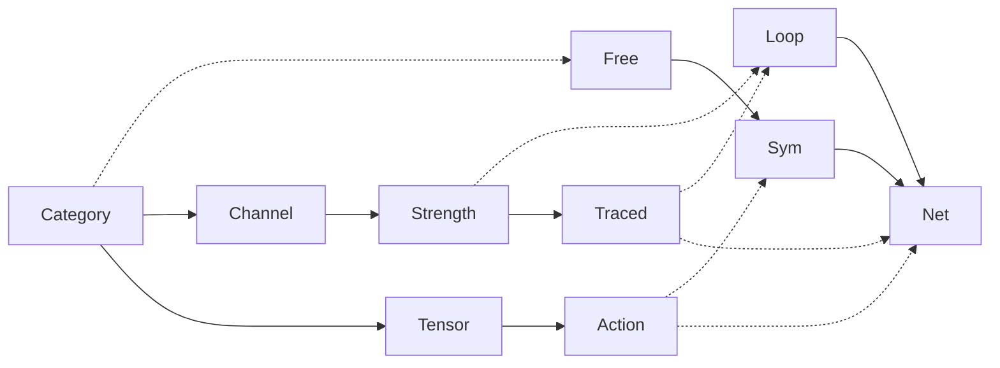
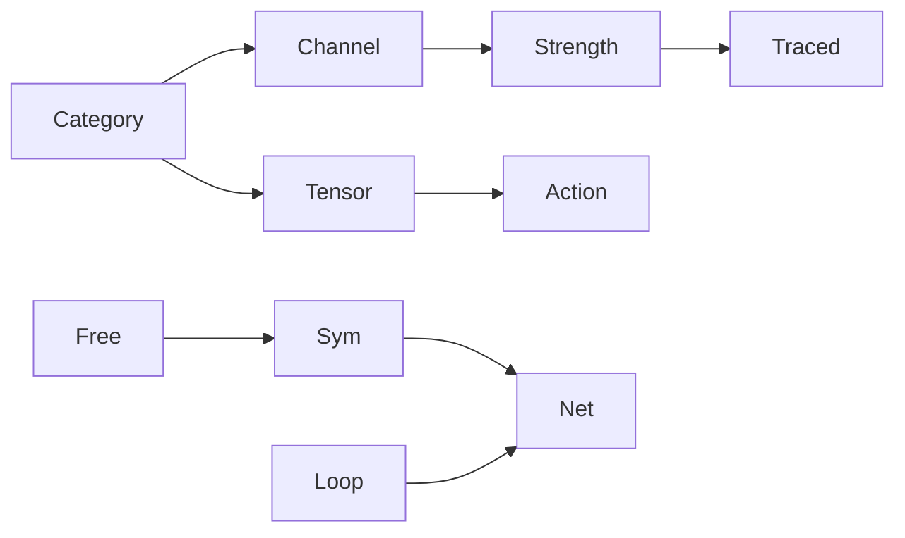
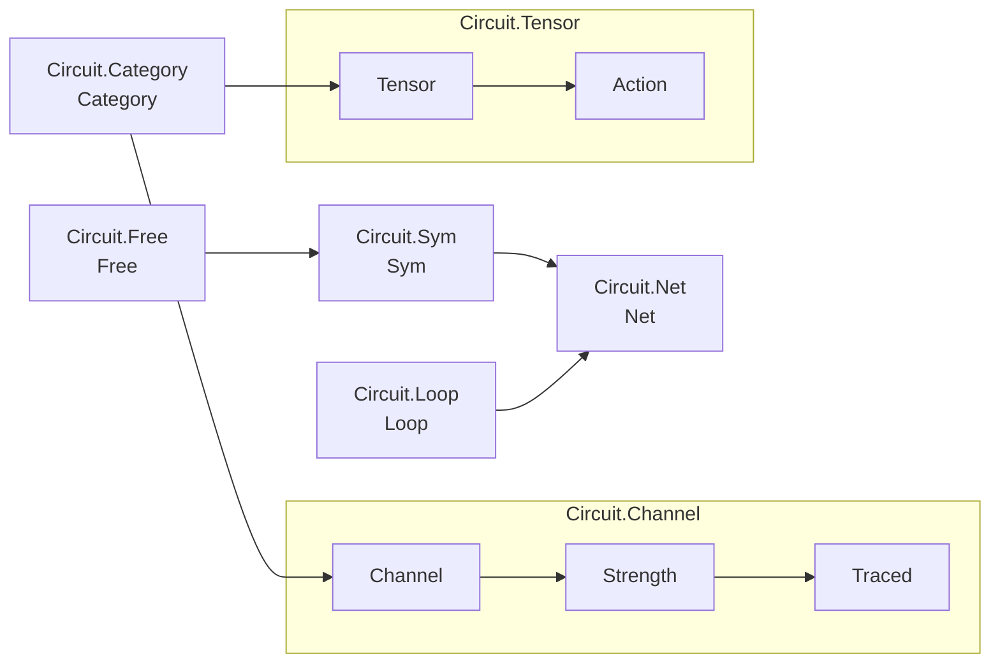

# circuits — API structure

## class relationships

**Solid arrows** show enrichment:
- Structural semantics: `Category → Channel → Strength → Traced`
- Functorial semantics: `Category → Tensor → Action`
- Syntax: `Free → Sym → Net` with `Loop` enriching to `Net`

**Thick magenta dashed arrows** are the `Layer` Laws — the constraints the type
family attaches to each syntax constructor:
- `Law Free = Discrete`
- `Law Sym = Action (,) + Discrete`
- `Law (Loop t) = Traced t + Discrete`
- `Law (Net t) = Traced t + Action (,) + Discrete`

**Other dashed arrows** are conceptual consumption / free construction:
`Category → Free` and `Strength → Loop`.

`Loop → Net` is `enrich` — embedding the normal form into inspectable wiring.
`melt` (the forgetful fold `Net → Loop`) is one of many folds and is not drawn.

`Ends` (including boxes and queues), `Hyper`, and `Dagger` are deliberately
omitted from this core structure diagram.

## semantic and syntax streams

Same structure with the Law/construction dashed lines removed:

## module view

Transparent boxes group the two enrichment zones by module:

