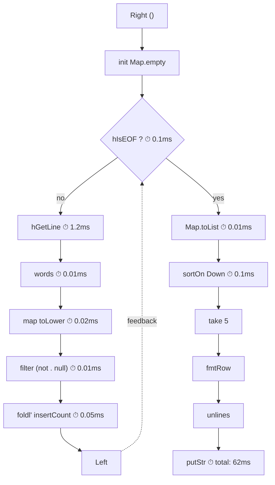

<p align="center"><strong>⟴ circuits</strong></p>

## first-class feedback

circuits builds off of a simple premise; create a datatype, Circuit, with three tags or constructors:

**Lift** ⟜ embeds a plain function.

**Compose** ⟜ composes two lifted functions

**Knot** ⟜ is Lift where input and output share a channel, and the sharing is made visible by the tensor.

In every case, the tags delay a final closing of ordinary functions: Lift delays function application, Compose function composition, and Knot function feedback. A Circuit can then be rearranged, measured, substituted, annotated — or left open to further transformation before it runs.

This is the sense in which the library treats feedback as first-class.

semantics
##

If you interpret these three tags carefully, Circuit comes with a very nice set of axioms that formally are captured by the notion of a traced category.

The semantics of these constructors can be seen in reify:

``` haskell
↘ (↑ f)       =  f                   — a lifted function just runs
↘ (↮ k)       =  ↪ k                 — a knot traces the channel closed
↘ (↮ f ⊙ g)   =  ↪ (f . ↩ (↘ g))     — g slides inside the loop
↘ (f ⊙ g)     =  ↘ f . ↘ g           — composition interprets both sides

Where: ↑ = Lift, ↮ = Knot, ⊙ = Compose, ↘ = reify, ↪ = trace, ↩ = untrace.

```

There is another semantic interpretation — encode into a hyperfunction:

``` haskell
encode (Lift f)      = lift f
encode (Compose f g) = encode f . encode g
encode (Knot f)      = trace (lift f)    -- Hyper's Trace instance, not the base arrow's
```

The `trace` in the Knot case is Hyper's own `Trace` instance. Where `Trace (->) (,)` ties a lazy knot with a single `let` binding, `Trace Hyper (,)` ties a coinductive one: the feedback value cycles through Hyper continuations rather than a recursive thunk. The knot remains structural — it can still be composed, rearranged, encoded further — rather than collapsing to a plain function.

``` haskell
newtype Hyper a b = Hyper { invoke :: Hyper b a -> b }
```

Under encode, the tags dissolve. What remains is a single coinductive type where every value carries its own continuation — the feedback channel that Knot surfaced becomes structural in the type itself. The two interpretations meet at the triangle: `lower . encode = reify`.

The final encoding seems to provide very strong guarantees: O(1) amortised composition with no left-nesting penalty; a structural guarantee that sliding holds; and efficient coinductive feedback. That's the hope at least.

From another perspective, circuits is a paean to some underappreciated pearls in the Haskell infrastructure. The lazy-knot of loop and the engineering that caters for it kind of got buried in the arrows side-pocket. And applying delimited continuation primitives so readily and clearly is a reward of sticking with the boring nature of static typing. By doing nothing but delay stuff, and keeping arrow scheduling open, application space can encompass parsing, streaming, performance metering & process wiring. 

## ⚙️ Install

```
(m)cabal build circuits
```

Compiles on MicroHS & GHC 9.10+ with `base` & `profunctors`

## 📡 Usage

```haskell
import Circuit

-- Fibonacci via knot-tying
>>> take 5 (trace (\(fibs, ()) -> (0 : 1 : zipWith (+) fibs (drop 1 fibs), fibs)) () :: [Integer])
[0,1,1,2,3]

-- Word count from a file: see examples/words.md for the full pipeline
-- with diagram, isolated components, and one-line metering.
>>> :{
let countStep (Right (h, acc)) = do
      eof <- hIsEOF h
      if eof then pure (Right acc)
      else hGetLine h >>= \line ->
        pure (Left (h, foldl' (\m w -> Map.insertWith (+) w (1::Int) m) acc (words line)))
    countStep (Left s) = countStep (Right s)
:}

>>> withFile "other/alice.md" ReadMode $ \h ->
      runKleisli (trace (Kleisli countStep)) (h, Map.empty :: Map String Int)
    & fmap (take 5 . sortOn (Down . snd) . Map.toList)
fromList [("the",1523),("and",779),("to",720),("a",616),("she",501)]
```

The Either tensor gives you iteration for free — `Left` continues, `Right` exits. Both the Handle and the accumulator ride the feedback channel as explicit state. For the full pipeline with isolated components, a mermaid diagram, and one-line metering, see [examples/words.md](examples/words.md).

## 📊 why circuits

With circuits-meter, timing is a one-liner. Here's the same word-count pipeline with wall-clock timings on every component:



Each component can be metered independently — the circuit structure makes the insertion points obvious. [examples/words.md](examples/words.md) has the full code.

## 📦 Application

circuits is being developed alongside:

**[circuits-parser](https://github.com/tonyday567/circuits-parser)** — presents a parser as `newtype Parser f a = Parser { circuit :: Circuit (->) Either f (These a f) }` for a wide variety of `f` and `a`, with `runParser` as `reify . circuit`.

**[circuits-io](https://github.com/tonyday567/circuits-io)** — uses `Circuit (Kleisli m) Either` with `m` as `STM` and `IO` to orchestrate file I/O, sockets, queues, servers, timings and (a)synchronicity.

**[circuits-meter](https://github.com/tonyday567/circuits-meter)** — circuit measurement and performance, taking advantage of channel provision via `ambient`.

## 📖 Read

[Kidney & Wu (2026)](https://doi.org/10.1145/3776649) — hyperfunctions as communicating continuations; the producer-consumer decomposition that Hyper unifies.

["Coroutining Folds with Hyperfunctions"](https://doi.org/10.4204/eptcs.129.9) — Launchbury, Krstic & Sauerwein (2013). The original hyperfunction axiom system that circuits builds on.

`other/` — the narrative arc: notation, marks and stacks, the Knot derivation, the triangle proof, tensor choice, the Mendler case, and worked examples. The long version of what this readme sketches.

`examples/` — cards: parsers, pipes, Elgot iteration, delimited continuations. Paste code blocks into `cabal repl`.

## Contributing

We welcome contributions of any persuasion or fancy. New contributors should open an issue and say hi.

LLM policy

LLMs and agents have been used in the development of this library, including category theory, coding, generation, refactoring, documentation and narrative.

what we prefer
  ⟜ all code must compile, have and pass doctests, and be reviewable.
  ⟜ do not submit code where intent is opaque, or that is difficult to read, understand, test and reason about.
  ⟜ respects a library style of supplying comments, annotation and examples that form an integral whole together with the code submitted.

<br>

[](https://hackage.haskell.org/package/circuits)
[](https://github.com/tonyday567/circuits/actions/workflows/haskell-ci.yml)
