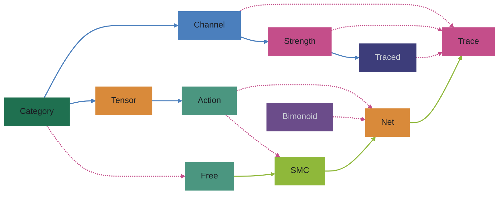
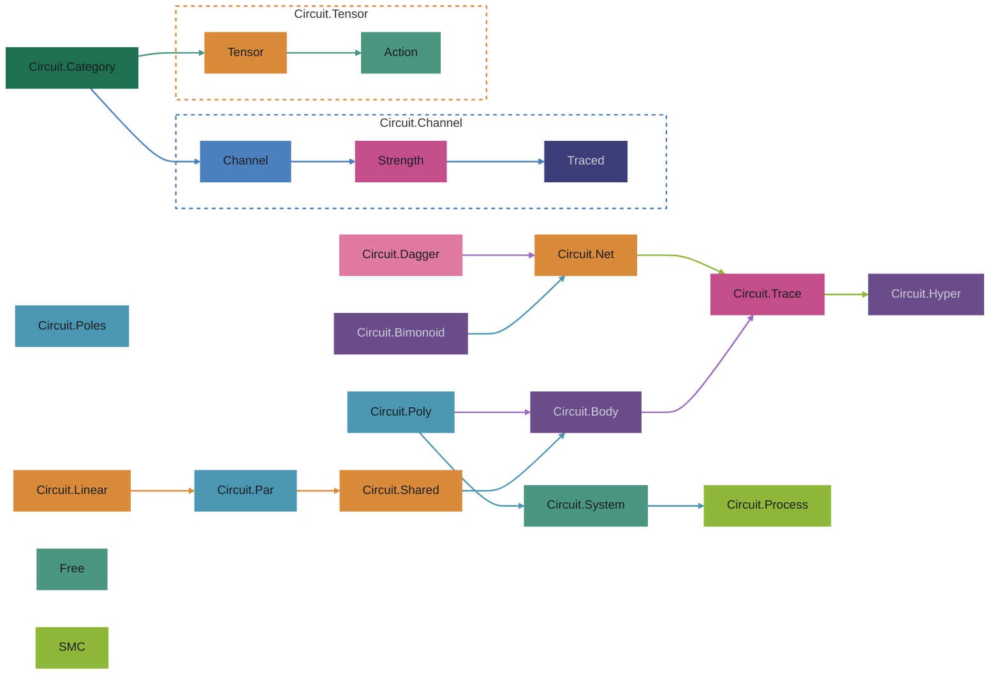

<strong>⟴ circuits</strong>

`circuits` is a toolkit for analysing circuits. A circuit, here, is any
computation that has direction, sequence, and flow: data moves through arrows,
feeds back on itself, and forks or joins along the way. The library gives you
small, composable pieces for building those structures and reasoning about them.

Solid arrows are enrichment; dashed arrows are the laws a free construction
draws on when it folds. ([open full page](other/circuits-class.html))

The module view groups the classes into their source files and adds the
satellites around the core. ([open full page](other/circuits-module.html))

## the shape of the library

Everything is built over a base arrow that you bring — `(->)`, `K m`,
`Process`, `FinRel`, matrices over a semiring. The library does not pick a
semantics; it adds structure along two ladders and one common shape.

**A ladder of laws.** The type classes form chains out of `Category`:
`Channel → Strength → Traced` (monoidal structure, tensorial strength, feedback
via trace) and `Tensor → Action` (the concrete `(,)` and `Either` machinery).
Each rung is one more law a target category can satisfy. These classes say
nothing about syntax; they are the contracts that folds have to meet.

**A common shape.** Under all the syntax lives `Body t ch arr a b`, the
category `arr (t ch a) (t ch b)`. A body threads an ambient channel `ch`
alongside a payload, under a tensor `t`. It is the shared substrate of loops,
processes, systems, and poles: the stateful machinery that `Trace` hides
before tracing.

**A deck of languages.** The GADTs form a chain of free constructions, each
rung one enrichment of the last:

    Free = Lift + Compose
    SMC  = Free + Par + Swap
    Net  = SMC + Copy + Discard + Plus + Zero

`Free` is the free category; `SMC` the free symmetric monoidal category; `Net`
the free symmetric monoidal category with a bimonoid, where every wire is a
constructor you can inspect. `Trace` sits to the side of this chain rather than
on it: it is the free traced monoidal category *in normal form*. Its laws are
performed by its instances, so every value collapses to at most one `yank` over
a base arrow. `Net` and `Trace` are the two poles of the library — wiring you
can read backwards, and wiring that has been melted into a single loop. `melt`
goes from `Net` to `Trace`; feedback lives in `Trace`, not in `Net`.

**Between the ladders** there is a family of folds. Each free construction can
be evaluated into any target category that satisfies the right laws; the GADT's
constructors are forgotten one at a time. `Layer` captures this pattern
uniformly, and `Circuit.Syntax` provides the same deck à la carte from signature
functors.

**Four axes.** The library's breadth comes from four independent parameters:

- `t` — the feedback tensor: `(,)` for lazy dataflow, `Either` for iteration,
  `These` for scheduling / shared-medium fusion.
- `arr` — the base arrow: `(->)`, `K m` for effects, `Process` for streaming,
  `FinRel` for nondeterminism, matrices over a semiring.
- `s` / `ch` — the residual state carried by a `Body` / `System`; `Body` makes
  this channel explicit before tracing.
- `p` — the polynomial interface in `Circuit.Poly`; `Mono i o` is a Moore
  machine / lens, general `p` adds sums, products, dependent lenses and prisms,
  giving `Circuit.Poly.Channel` its interactive channel model.

The recent refactor crystallised this around `Body t ch arr a b`. Everything
stateful — `Process`, `SystemT`, `Poles` — is a specialisation or projection of
it.

In many of the free objects we tag common computation patterns: function
application, composition, tracing, and type tensoring. This bootstraps a
first-class foundation for computational circuits — direction, sequence, and
flow — without baking in a particular semantics too early.

Applications and closures can be delayed for analysis and measurement, or
retried. The feedback itself is visible as a wire, not hidden in a closure.

## potential uses

The core stays small; companion libraries apply it to specific domains.

| library | what it adds |
|---------|-------------|
| [circuits-ad](https://github.com/tonyday567/circuits-ad) | reverse-mode automatic differentiation, pullbacks, and star-elimination |
| [circuits-examples](https://github.com/tonyday567/circuits-examples) | paste-into-GHCi example cards |
| [circuits-int](https://github.com/tonyday567/circuits-int) | Int construction and polynomial-functor sketches |
| [circuits-io](https://github.com/tonyday567/circuits-io) | sockets, queues, servers, and concrete IO transports |
| [circuits-llm](https://github.com/tonyday567/circuits-llm) | small transformer-style language-model experiments |
| [circuits-machina](https://github.com/tonyday567/circuits-machina) | inward measurement, gap diagnosis, and machine observation |
| [circuits-mat](https://github.com/tonyday567/circuits-mat) | matrices over a semiring as a traced monoidal category |
| [circuits-meter](https://github.com/tonyday567/circuits-meter) | one-line performance metering and stopwatch pipelines |
| [circuits-parser](https://github.com/tonyday567/circuits-parser) | parser combinators over a coinductive stream decomposition |
| [circuits-pca](https://github.com/tonyday567/circuits-pca) | principal component analysis as a residual-ownership protocol |
| [circuits-repl](https://github.com/tonyday567/circuits-repl) | REPL primitives: commit/emit dual, turns, channels, sessions |

## install

Add `circuits` to your `build-depends`. GHC 9.10+ (tested with 9.14).
Dependencies beyond base: `these`.

## examples

The example cards live in the separate
[circuits-examples](https://github.com/tonyday567/circuits-examples) repository.
Each `.md` file is a short, paste-into-GHCi walkthrough with YAML front matter
(`name`, `description`, `tags`).

Cards are not a secondary dump for outdated material — they are the development
surface of the library. Stable cards document supported API; experimental cards
grow ideas that are not yet in the API. When a card matures, it gets promoted
into `src/` and the public API.

## ephemeral

Local sibling-package paths (e.g. when building `circuits-machina` against a
local `circuits-tools`) belong in `cabal.project.local`, which overrides
`cabal.project`. Do not commit `cabal.project` with ad-hoc local package links;
keep them in the ephemeral `.local` file.

## thanks

Built on [Launchbury, Krstic & Sauerwein (2013)](https://doi.org/10.4204/eptcs.129.9)
and [Kidney & Wu (2026)](https://doi.org/10.1145/3776649). The `Hyper` type is
theirs; the normal form that makes it inspectable is ours.

LLMs and agents helped with category theory, coding, refactoring, and
documentation.

 

